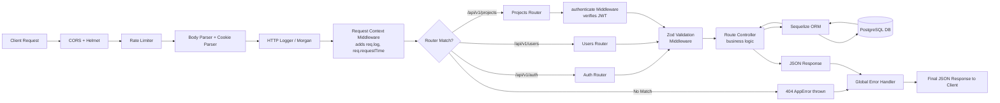
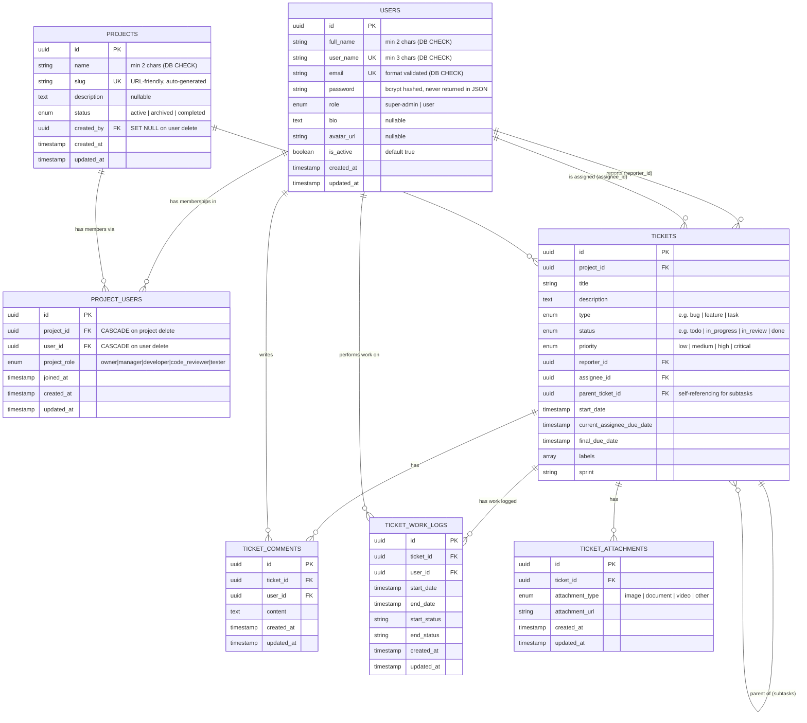

# Backend — Architecture & Developer Guide

> **Note on diagrams:** This file uses [Mermaid](https://mermaid.js.org/) for flowcharts and ERDs. To render them in VS Code, install the [Markdown Preview Mermaid Support](https://marketplace.visualstudio.com/items?itemName=bierner.markdown-mermaid) extension. They also render natively on GitHub.

---

## Table of Contents
1. [Tech Stack](#tech-stack)
2. [Folder Structure](#folder-structure)
3. [How a Request Flows Through the Server](#how-a-request-flows-through-the-server)
4. [Middleware Stack (Detailed)](#middleware-stack-detailed)
5. [Feature Module Pattern](#feature-module-pattern)
6. [Authentication System](#authentication-system)
7. [Database Schema & Relationships](#database-schema--relationships)
8. [Migrations & Why They Matter](#migrations--why-they-matter)
9. [Error Handling Architecture](#error-handling-architecture)
10. [Environment Configuration](#environment-configuration)
11. [API Reference](#api-reference)

---

## Tech Stack

| Concern | Library |
|---|---|
| Runtime | Node.js (v24+) with native ES Modules (`type: module`) |
| Framework | Express.js (v5) |
| Database | PostgreSQL |
| ORM | Sequelize v6 |
| Migrations | sequelize-cli |
| Authentication | JWT (JSON Web Tokens) via `jsonwebtoken` |
| Password Hashing | `bcryptjs` |
| Input Validation | `zod` |
| Logging | `winston` + `morgan` |
| Security | `helmet`, `cors`, `express-rate-limit` |

---

## Folder Structure

```
backend/
├── src/
│   ├── app.js                  # Express app: registers all middleware and routes
│   ├── server.js               # Entry point: starts HTTP server, connects to DB
│   │
│   ├── config/
│   │   ├── database.js         # Sequelize instance (single shared connection pool)
│   │   └── config.cjs          # sequelize-cli DB config (dev / qa / staging / prod)
│   │
│   ├── constants/
│   │   ├── databaseEnums.js    # Single source of truth for all DB ENUM values
│   │   └── logActions.js       # String constants for structured log action names
│   │
│   ├── db/
│   │   ├── migrations/         # Sequelize migration files (.cjs) — DB schema history
│   │   └── seeders/            # Sequelize seeder files (.cjs) — initial/test data
│   │
│   ├── features/               # Feature-based modules (each has its own files)
│   │   ├── auth/               # Signup, login, logout + JWT middleware
│   │   ├── users/              # User profile CRUD
│   │   ├── projects/           # Project CRUD
│   │   └── project-users/      # Project membership + role management
│   │
│   ├── middlewares/
│   │   ├── errorMiddleware.js  # Global error handler (converts errors → JSON)
│   │   ├── loggerMiddleware.js # HTTP logging (Morgan) + contextual req.log
│   │   └── validate.js         # Zod validation wrapper middleware
│   │
│   └── utils/
│       ├── appError.js         # Custom Error class (wraps operational errors)
│       └── logger.js           # Winston logger instance
│
├── scratch/                    # ⚠️ Local-only scripts (git-ignored). Never production code.
├── .sequelizerc                # Tells sequelize-cli where to find migrations and config
└── .env                        # Git-ignored. Environment variables.
```

---

## How a Request Flows Through the Server

This is the most important thing to understand first. Every single API call travels through this exact pipeline:



**Key things to notice:**
- `authenticate` middleware only runs on protected routes (projects, users). Auth routes are public.
- `validate` middleware runs Zod schema checks before any controller logic runs.
- The global error handler at the end catches **all** errors thrown anywhere in the pipeline, so controllers never need `try/catch` blocks.

---

## Middleware Stack (Detailed)

Middleware is applied in the order it appears in `app.js`. The sequence matters.

### 1. CORS
Allows requests from the frontend origin (`CLIENT_URL` in `.env`). Configured with `credentials: true` so the browser sends cookies (for JWT cookie auth).

### 2. Helmet
Sets ~15 security-related HTTP headers automatically (e.g., prevents clickjacking, XSS via scripts, etc.). One line of code, significant security gain.

### 3. Rate Limiter
Limits each IP to **200 requests per 15 minutes** on all `/api` routes. Prevents brute-force attacks on login endpoints and general DDoS. Returns a `429 Too Many Requests` if exceeded.

### 4. Body / Cookie Parser
- `express.json()` — parses incoming JSON bodies into `req.body`. Capped at `10kb` to prevent payload-bloat attacks.
- `cookieParser()` — parses cookies into `req.cookies`. Used to read the `jwt` cookie for auth.

### 5. Logger Middleware (`loggerMiddleware.js`)
Three separate layers:
- **`httpLogger`** — Morgan, logs every HTTP request line (method, URL, status, response time).
- **`requestContext`** — Attaches a `req.log` child logger to every request, pre-tagged with the user's IP and (once authenticated) userId. This means every `req.log.info(...)` call you see in a controller is automatically correlated to one specific request.
- **`logUserRequest`** — Logs the incoming request details at the start of the pipeline (only on `/api/*`).

### 6. `validate.js` (Zod)
A reusable middleware factory. You pass it a Zod schema, and it validates `req.body`, `req.params`, and `req.query` against it before the controller ever runs. If validation fails, it throws an `AppError` with a 400 status, listing all field errors.

### 7. `authenticate` (auth.middleware.js)
JWT guard for protected routes. It:
1. Looks for a token in the `Authorization: Bearer <token>` header first, then falls back to the `jwt` cookie.
2. Verifies the token's signature using `JWT_SECRET`.
3. Looks up the user in the DB by the `id` stored in the token payload.
4. Attaches the found user to `req.user` so any downstream controller can access the logged-in user without another DB query.

---

## Feature Module Pattern

Every feature follows the same structure. This is important — when adding a new feature, replicate this pattern exactly:

```
features/my-feature/
├── myFeature.model.js      → Sequelize model (JS representation of the table)
├── myFeature.schema.js     → Zod validation schemas for request bodies
├── myFeature.controller.js → Business logic (query DB, build response)
└── myFeature.routes.js     → Express router (maps HTTP verbs + URLs to controllers)
```

**Why this pattern?**
- Each feature is self-contained. You can read, understand, and modify one feature without touching others.
- Adding a new feature is predictable: create the 4 files, wire the router into `app.js`.

---

## Authentication System

The app uses a **dual-token strategy**: JWT can be delivered as either a cookie or a Bearer header, giving flexibility to both browser clients (cookies) and API clients / mobile apps (headers).

```
SIGNUP / LOGIN
──────────────
Client sends credentials
        │
        ▼
auth.controller.js validates them
        │
        ▼  (on login, password compared with bcrypt)
JWT signed with JWT_SECRET (expires in JWT_EXPIRES_IN, default 7 days)
        │
        ├── Set as HttpOnly cookie "jwt" (protects against XSS)
        └── Also returned in JSON body (for non-browser clients)

AUTHENTICATED REQUEST
─────────────────────
Client sends JWT (cookie or Authorization header)
        │
        ▼
authenticate middleware
        │
        ├── Extracts token
        ├── Verifies signature (throws 401 if tampered / expired)
        ├── Finds user in DB (throws 401 if user deleted)
        └── Attaches user to req.user → controller can use it
```

**Password Security:** Passwords are never stored in plaintext. The `beforeSave` hook in `user.model.js` automatically runs `bcrypt.hash()` with a salt factor of 12 every time a password is created or changed. The `toJSON()` method strips the password field before any User object is ever serialized to JSON.

---

## Database Schema & Relationships

All dates/timestamps are stored as UTC `TIMESTAMP` (without timezone). `camelCase` in JavaScript models maps to `snake_case` in the database via `underscored: true` in the global Sequelize config.



### Key Design Decisions

**Why `project_users` is a separate table?**
A user can be a `developer` in Project A but an `owner` in Project B. Their role is not a property of the user — it's a property of their *relationship* with a specific project. This junction table captures that.

**Why `created_by` on `projects` can be SET NULL?**
If the user who created a project is deleted from the platform, the project itself should survive. We lose the historical reference, but the project and all its data remain intact.

**Why a `parent_ticket_id` self-reference on `tickets`?**
This enables subtask support. A ticket can be a child of another ticket in the same project, which is how Jira handles epics → stories → tasks hierarchies.

**Why `ticket_work_logs`?**
This table records a snapshot of who worked on a ticket, from when to when, and what the status was at the start and end of their session. It's the foundation for a future time-tracking / velocity reporting feature.

---

## Migrations & Why They Matter

This project uses **Sequelize CLI migrations** instead of `sequelize.sync()`.

The critical difference: `sequelize.sync()` reads your current model files and updates the DB to match. This is fine for early development but **destructive and unpredictable in production** — it can silently drop or alter columns when your models change.

Migrations are plain `.cjs` files that define an explicit, irreversible history of what SQL operations to run:
- `up()` — apply the change (e.g. `createTable`, `addColumn`)
- `down()` — undo the change (e.g. `dropTable`, `removeColumn`)

Sequelize tracks which migrations have been applied in a `SequelizeMeta` table. Running `npx sequelize-cli db:migrate` only applies the unapplied ones, in order, safely.

> **Important:** Migration files live in `src/db/migrations/` and are named `.cjs` (CommonJS) because `sequelize-cli` doesn't support ES Modules. The app code stays as ES Modules (`.js`).

**Model vs Migration consistency** is a discipline issue. The migration defines the *real* DB structure. The model is your *JavaScript interface* to it. Keep them in sync. The `databaseEnums.js` constants file is a direct tool for this — both the model and migration draw from the same array.

---

## Error Handling Architecture

There are no `try/catch` blocks in controllers. Express 5 natively catches async errors thrown from route handlers and passes them to the error middleware. Two error types exist:

**1. `AppError` (Operational Errors)** — Problems that are expected and safe to report to the client (wrong password, project not found, validation failure, etc.). Has `isOperational: true`.

**2. Unhandled Errors (Programming Bugs)** — Unexpected crashes, null reference errors, etc. These are logged with full stack traces server-side but the client only sees a generic `"Something went wrong"` message. This prevents leaking implementation details.

The global error handler in `errorMiddleware.js` also translates Sequelize-specific errors (like `SequelizeUniqueConstraintError`) into clean `AppError` instances before responding.

---

## Environment Configuration

The `.env` file is git-ignored. Copy `.env.example` to `.env` to get started.

| Variable | Description |
|---|---|
| `NODE_ENV` | `development` \| `qa` \| `staging` \| `production` |
| `PORT` | Port the server listens on |
| `DB_NAME` | PostgreSQL database name |
| `DB_USER` | PostgreSQL user |
| `DB_PASSWORD` | PostgreSQL password |
| `DB_HOST` | Database host |
| `DB_PORT` | Database port (default `5432`) |
| `DB_LOGGING` | Set to `"true"` to log all SQL queries to console |
| `JWT_SECRET` | Secret key for signing JWTs (keep this secure!) |
| `JWT_EXPIRES_IN` | Token lifespan e.g. `"7d"` |
| `JWT_COOKIE_EXPIRES_IN` | Cookie lifespan in days |
| `CLIENT_URL` | Frontend URL for CORS whitelist |

> `config.cjs` maps `NODE_ENV` to the right DB credentials for `sequelize-cli`. It supports `development`, `test`, `qa`, `staging`, and `production` blocks.

---

## API Reference

All endpoints are prefixed with `/api/v1`.

### Auth — `/api/v1/auth`
| Method | Endpoint | Auth | Description |
|---|---|---|---|
| `POST` | `/signup` | ❌ Public | Create a new account |
| `POST` | `/login` | ❌ Public | Login and receive a JWT |
| `POST` | `/logout` | ❌ Public | Clear the JWT cookie |

### Users — `/api/v1/users`
| Method | Endpoint | Auth | Description |
|---|---|---|---|
| `GET` | `/` | ✅ Required | List all users |
| `GET` | `/me` | ✅ Required | Get currently logged-in user |
| `PATCH` | `/me` | ✅ Required | Update own profile (fullName, bio, avatarUrl) |
| `PATCH` | `/me/password` | ✅ Required | Change own password |
| `GET` | `/:id` | ✅ Required | Get a specific user by ID |

### Projects — `/api/v1/projects`
| Method | Endpoint | Auth | Description |
|---|---|---|---|
| `GET` | `/` | ✅ Required | List all projects the user is a member of |
| `POST` | `/` | ✅ Required | Create a new project (creator auto-assigned as `owner`) |
| `GET` | `/:projectSlug` | ✅ Required | Get project details (must be a member) |
| `PATCH` | `/:projectSlug` | ✅ Required | Update project details |
| `DELETE` | `/:projectSlug` | ✅ Required | Delete a project |

### Project Members — `/api/v1/projects/:projectSlug/members`
| Method | Endpoint | Auth | Description |
|---|---|---|---|
| `GET` | `/` | ✅ Required | List all members of a project |
| `POST` | `/` | ✅ Required | Add a user to a project with a role |
| `PATCH` | `/:userId` | ✅ Required | Change a member's role (cannot change owner) |
| `DELETE` | `/:userId` | ✅ Required | Remove a member (cannot remove owner) |
