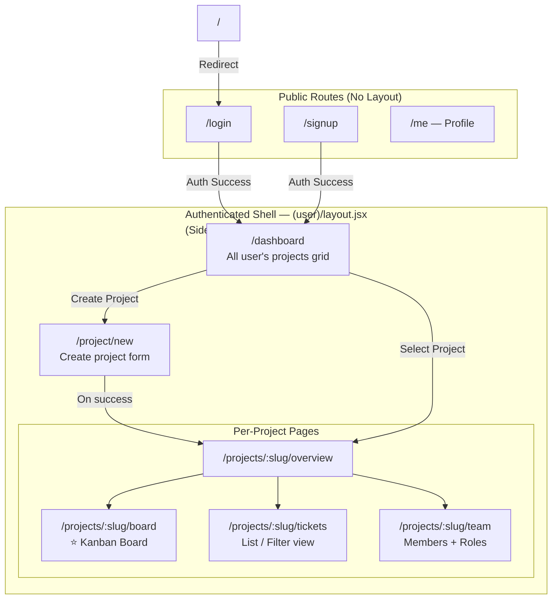

# Frontend — Architecture & Developer Guide

> **Note on diagrams:** This file uses [Mermaid](https://mermaid.js.org/) for flowcharts. To render them in VS Code, install the [Markdown Preview Mermaid Support](https://marketplace.visualstudio.com/items?itemName=bierner.markdown-mermaid) extension. They also render natively on GitHub.

---

## Table of Contents
1. [Tech Stack](#tech-stack)
2. [Folder Structure](#folder-structure)
3. [Routing Architecture (Next.js App Router)](#routing-architecture-nextjs-app-router)
4. [Page & Feature Breakdown](#page--feature-breakdown)
5. [Shared Components](#shared-components)
6. [Authentication Flow (Client-Side)](#authentication-flow-client-side)
7. [State Management & Data Fetching](#state-management--data-fetching)

---

## Tech Stack

| Concern | Library |
|---|---|
| Framework | Next.js (App Router) |
| Language | JavaScript (JSX) |
| Styling | Tailwind CSS |

---

## Folder Structure

```
frontend/
└── src/
    ├── app/                          # Next.js App Router — every folder = a route
    │   ├── layout.jsx                # Root HTML layout (applies to all pages)
    │   ├── page.jsx                  # Root "/" redirect page
    │   ├── globals.css               # Global CSS variables and base styles
    │   ├── not-found.jsx             # Custom 404 page
    │   │
    │   ├── login/                    # → /login
    │   ├── signup/                   # → /signup
    │   ├── me/                       # → /me (profile page)
    │   │
    │   └── (user)/                   # Route Group — applies shared layout (sidebar, etc.)
    │       ├── layout.jsx            # Auth-protected shell layout (sidebar + header)
    │       ├── dashboard/            # → /dashboard
    │       └── projects/
    │           ├── layout.jsx        # Project list layout
    │           └── [project]/        # → /projects/:project (dynamic segment)
    │               ├── overview/     # → /projects/:project/overview
    │               ├── board/        # → /projects/:project/board
    │               ├── tickets/      # → /projects/:project/tickets
    │               └── team/         # → /projects/:project/team
    │
    ├── components/                   # Shared, reusable UI components
    │   ├── Header.jsx
    │   ├── SideNavbar.jsx
    │   ├── Footer.jsx
    │   ├── Logo.jsx
    │   ├── BackButton.jsx
    │   └── ui/                       # Atomic UI components (buttons, inputs, cards...)
    │
    ├── features/                     # Feature-specific logic and components
    │   ├── auth/
    │   ├── dashboard/
    │   ├── projects/
    │   └── users/
    │
    └── lib/                          # Utility functions, API clients, helpers
```

**Key concept — Route Groups `(user)`:**
The `(user)` folder name is wrapped in parentheses. This is a Next.js App Router feature called a **Route Group**. It lets you apply a shared layout (the authenticated shell with sidebar, header, etc.) to a set of routes **without adding the folder name to the URL**. So `/dashboard` and `/projects/my-project/board` both render inside the authenticated layout, but the `(user)` segment never appears in the browser's address bar.

---

## Routing Architecture (Next.js App Router)



---

## Page & Feature Breakdown

### 🔓 Public Pages

#### `/login`
The entry point for returning users. Contains an email + password form. On successful login, the server returns a JWT (set as an HttpOnly cookie and also in the JSON response body). The user is redirected to `/dashboard`.

#### `/signup`
Registration page. Collects `fullName`, `userName`, `email`, and `password`. On success, the user is logged in automatically (same token response as login) and redirected to `/dashboard`.

---

### 🔐 Authenticated Pages (inside `(user)` route group)

All pages below are wrapped by the `(user)/layout.jsx` which provides the persistent sidebar and header navigation. A user who is not authenticated should be redirected back to `/login`.

---

#### `/me` — Profile Page
The user's own profile management page. Allows editing:
- `fullName`
- `bio`
- `avatarUrl`

Changing the password is a separate action (requires entering the current password).

---

#### `/dashboard` — Main Landing Page
The first page a user sees after logging in. It acts as a hub for all the user's work.

**What it shows:**
- A **grid of project cards**, one for each project the user is a member of (both projects they created and projects they were invited to).
- Each card shows: project name, the user's role in that project, status, and a brief description.
- A prominent **"Create Project"** button that navigates to `/project/new`.

**Key point:** The projects shown are fetched from `GET /api/v1/projects`, which automatically filters to only the projects the logged-in user is a member of. The backend does the filtering — the frontend just displays what it receives.

---

#### `/project/new` — Create Project
A simple form page with fields for:
- Project `name`
- Project `description` (optional)

The `slug` is auto-generated on the backend from the project name (e.g. `"My Awesome Project"` → `"my-awesome-project"`). On submission, a `POST /api/v1/projects` request is made. On success, the user is redirected to the new project's overview page and is automatically the project **Owner**.

---

#### `/projects/:slug/overview` — Project Overview
The "home page" of a specific project. Gives a high-level health snapshot of the project.

**What it shows:**
- Summary stats (total tickets, tickets completed, in-progress, blocked, etc.)
- Which team members are assigned to what (a quick at-a-glance view)
- Recent activity or recently updated tickets
- Project description and metadata (name, status, created by)

This is the page users land on immediately after creating a project or clicking into a project from the dashboard.

---

#### `/projects/:slug/board` — Kanban Board ⭐
The most important and complex page in the application. This is the interactive Jira-style board.

**How it works:**
- Ticket statuses are represented as **columns** (e.g. `To Do`, `In Progress`, `In Review`, `Testing`, `Done`).
- Each ticket appears as a **card** within its status column, showing: title, priority, type, and assignee avatar.
- Users can **drag and drop** a ticket card from one column to another, which triggers a `PATCH` request to update the ticket's `status` in the database in real time.
- Clicking a ticket card opens a detail panel or modal showing the full ticket information (description, comments, work log, attachments).

**Visibility rules (enforced on the backend):**
- `Owner` and `Manager` can see all tickets on the board.
- `Developer`, `Code Reviewer`, and `Tester` can only see tickets they are the **reporter** or **assignee** of.

**Planned:** A Backlog page with sprint management to allow organizing tickets into sprints before they appear on the board.

---

#### `/projects/:slug/tickets` — Ticket List
A tabular or list view of all tickets the user can see within the project. Unlike the board (which is visual and grouped by status), this view is optimized for **searching, filtering, and sorting**.

Filters may include: status, priority, type, assignee, reporter, label, sprint, and date ranges.

---

#### `/projects/:slug/team` — Project Team
Shows all members of the project with their roles and join dates.

**For Owners and Managers, this page also allows:**
- **Inviting** a registered user to the project by their email/username and assigning them a role.
- **Changing** an existing member's role.
- **Removing** a member from the project.

The Owner cannot be removed; ownership must be explicitly transferred first.

---

### 🔮 Planned / Future Pages

| Page | Description |
|---|---|
| `/projects/:slug/backlog` | Sprint planning page. Allows organizing tickets into sprints, creating new sprints, and managing the backlog. |
| `/admin/*` | System-level administration. Details TBD. |

---

## Shared Components

These are components in `src/components/` that are reused across multiple pages.

| Component | Purpose |
|---|---|
| `Header.jsx` | Top navigation bar. Shows app logo, user avatar, and profile/logout menu. |
| `SideNavbar.jsx` | The left-side project navigation menu. Shows links: Overview, Board, Tickets, Team. Active link is highlighted. |
| `Logo.jsx` | The application logo mark. Used in both the header and auth pages. |
| `BackButton.jsx` | A reusable back-navigation button, used on detail/form pages. |
| `Footer.jsx` | Page footer. |
| `ui/` | Low-level atomic components: buttons, form inputs, modals, cards, badges, etc. All pages are built using these. |

---

## Authentication Flow (Client-Side)

```
User submits Login Form
        │
        ▼
POST /api/v1/auth/login
        │
        ├── Server sets HttpOnly "jwt" cookie (auto-sent by browser on future requests)
        └── Server returns { token, data: { user } } in JSON body
                │
                ▼
        Store user data in client state (e.g. Context / Zustand)
        Store token in memory or localStorage (for API clients)
                │
                ▼
        Redirect to /dashboard

On every protected page load:
        │
        ▼
        Fetch /api/v1/users/me (or check local state)
                │
                ├── 200 OK → User is authenticated, render page
                └── 401 Unauthorized → Clear local state, redirect to /login
```

The JWT is sent back to the server on every request automatically because the browser attaches the `jwt` HttpOnly cookie. This means the frontend doesn't need to manually attach an `Authorization` header for browser-based requests — the cookie handles it.

---

## State Management & Data Fetching

> **Note:** The specific state management library chosen (Context API, Zustand, React Query, etc.) should be documented here once finalized. This section describes the *intent*.

**Global State (Client-wide):**
- Currently authenticated user object (from `/users/me`)
- Authentication status

**Server State (Per-page / Per-component):**
- Projects list (dashboard)
- Current project details (project pages)
- Tickets for a project (board, ticket list)
- Project members (team page)

Data is fetched from the backend REST API using the base URL configured in the environment (`NEXT_PUBLIC_API_URL`). All API calls should go through a centralized API client in `src/lib/` to standardize error handling, base URL, and auth token attachment.
